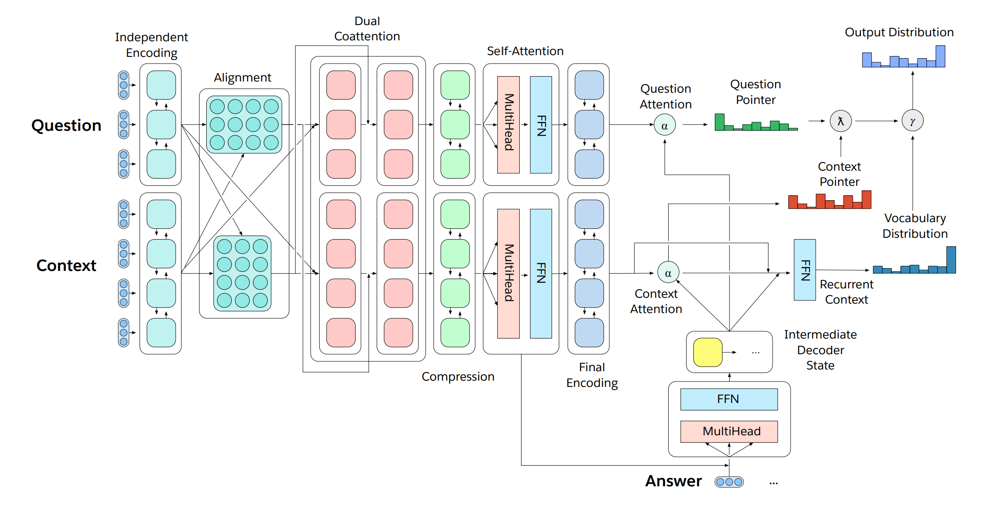

# Semi-supervised Natural Language Understanding

## Table of Contents

- [Semi-supervised Natural Language Understanding](#semi-supervised-natural-language-understanding)
  - [Table of Contents](#table-of-contents)
  - [Team](#team)
  - [Introduction](#introduction)
    - [**Semi-supervised** Natural Language Understanding:](#semi-supervised-natural-language-understanding)
    - [Semi-supervised **Natural Language Understanding**:](#semi-supervised-natural-language-understanding)
  - [Background](#background)
    - [Language Models](#language-models)
    - [Related work](#related-work)
  - [The Problem](#the-problem)
    - [Introduction](#introduction-1)
    - [Motivation](#motivation)
    - [Dataset](#dataset)
    - [Our Approach](#our-approach)
    - [Methods in more detail](#methods-in-more-detail)
      - [Performance metrics](#performance-metrics)
  - [Logistics](#logistics)
    - [Updated Timeline](#updated-timeline)
    - [Updated Division of Work](#updated-division-of-work)
  - [Reflections](#reflections)
    - [Differences and novelty](#differences-and-novelty)
  - [References and Citation](#references-and-citation)

## Team

- Team Name: Regrayshun
- Team Members:
  - Dhruv Dhamani (801084292) (ddhamani@uncc.edu)
  - Saloni Gupta (sgupta38@uncc.edu)
  - Himanshu Sunil Dhawale (hdhawale@uncc.edu)
  - Bhavya Chawla (bchawla@uncc.edu)

## Introduction

Let's break down the project title in two for clarity -

### **Semi-supervised** Natural Language Understanding:
  
Machine learning approaches are tending to either be supervised or unsupervised.

  - A supervised approach as in we when have curated data with a clear expectation for what parts of the data are the *input* to the model and what part the model is supposed to predict/infer or present as an *output*.
  - In general, unsupervised approaches mean that the data we have has not been labelled, classified or categorized. Instead, we create some sort of a feedback mechanism for the model which helps it identify commonalities in the data and react based on the presence or absence of such commonalities in each new piece of data.
  
  When we say *semi-supervised* what we mean is that we're going to take pre-existing labelled, classified or categorized data - the kind of data one uses for *supervised learning*, and transform and curate it into unlabeled data - the kind of data one uses for *unsupervised learning* - with the transformation or curation being done *on the basis of the labels of our pre-existing labelled data*, and then use this curated data for training our model.

  **Why would anyone do such a thing?** 
  
  Well, the motivation is simple. One could argue that as a general rule, there is a lot more unlabeled data in existence than labelled data. Thereby, if one creates a machine learning system that learns by use of unlabelled data, it is always going to have more data to learn from than a system that is based on learning from labelled data.

  And in most cases, the more data you have, the better machine learning systems can learn. Thusly, by transforming and curating labelled data for supervised learning approaches into unlabeled data for unsupervised learning approaches, we also manage to increase the available data for learning manifold; assuming the area of application of said machine learning system have availability of unlabeled data that can be learned from, and satisfactory feedback mechanisms for unsupervised learning to take place.

### Semi-supervised **Natural Language Understanding**:
  
  Natural language understanding or Natural language inference is a subtopic of natural-language processing in artificial intelligence that deals with machine reading comprehension. It can be thought of as what happens after natural language processing (NLP) - if a computer was presented with the sentence -
    
    This is a sentence.

  The results of performing NLP techniques and algorithms on this sentence would give us information about what the individual words in the sentence are relative to the grammar of that language, and what the relationship between the words in the sentence is. It would look something like -

  

  Now taking this set of information produced by NLP algorithms and getting a machine to _comprehend_ or _understand_ what the sentence means is what Natural Language Understanding/Inference is.

  Our above discussion of the motivation behind doing "semi-supervised" learning lead us to the conclusion that semi-supervised learning might be a good thing to do in the following scenarios -

  - when there is availability of large amounts of raw data that can be learned from
  - when there exist satisfactory feedback mechanisms to facilitate unsupervised learning
  - (and also, when labelled data can be transformed and curated into labelled data without a whole lot of hiccups)

  One field that satisfies all these requirements is Natural Language processing -

  1. Availability of large amounts of raw data - Large amounts of written down, digital representations of language, i.e. text, is basically what the internet is. I don't think more needs to be said here.
  2. Existence of satisfactory feedback mechanisms to facilitate unsupervised learning - Academia has been doing unsupervised learning in the field of Natural Language Processing for years. The process in which word vectors and language models are learnt - the process of capturing meaning of words in a vector of floating-point numbers by providing lots of examples of how the words are used in the natural language *is* unsupervised learning.
  3. Ease of transformation and curation of labelled data into unlabeled data - more on this in the review of related work and the approach and summary of methods sections below.

## Background

### Language Models

Traditionally, language models refer to statistical language models which can be thought of as a probability distribution over a sequence of words. Given a sequence of words (sentence, sentences, etc.), a statistical language model tells us the probability of that sequence of words existing in this language.

For instance, an English language model would assign `I love dogs` a higher probability than `I dogs love`. 

**Why is this important? **

In a way, language models assign a sensibility score or a naturalness score. This is due to the fact that the language models are trained with lots of sensible and natural sentences (ideally), and if so it is obvious that sentences like `I love dogs` (a sensible sentence) has a much higher probability in occurring the data the model has been trained with than `I dogs love` (a nonsensical one).

This is an important concept to remember for understanding the rest of this document. And as such we'll explain it again in a different way.

Consider the following two sentences -
```
A. I love dogs so I got one.
B. I dogs love in my car.
```

Now let us assume there exists a perfect, ideal language model. Would that model assign a higher score to sentence `A` or `B`? The answer is obviously `A`.
Let's say the model assigns a probability `0.0000000473` to the `A` and `0.00000000000000000000000000823` to `B`. On account of this score, we can conclude that `A` is a sentence that is more likely to *naturally occur* in the English language than `B`; and since sentences that *naturally occur* in the English language tend to be sentences that make sense, it is also okay to assume that `A` is a more sensible sentence than `B`.

Let's take things a step further and consider the next two sentences -
```
A. I love dogs so I got one.
B. I love dogs so Canada sucks.
```

What sort of score would a perfect, ideal language model assign to these sentences? They both seem grammatically correct, so the scores of both would probably be on the higher side. But which sentence is more _natural_? Probably the same sentence which is more sensible?

Let's read sentence `A` again. Getting a dog because you love dogs is a sensible thing to do. And at first glance `B` is a nonsensical sentence. But then again, we don't know the context of sentence `B`. Maybe the sentence is from an article about lawmakers in Canada proposing a bill that demands mandatory neutering of all dogs. In that case, `B` is a sensible sentence too.

But `A` is still more *natural* or more *sensible* than `B`, since `A` would make sense in most contexts, while `B` only makes sense in some contexts.

What we're trying to argue is that if language models are good enough, they can also be thought of as *Sensibility Models* or at least *Common Sense Models*.

Even if you do agree with everything that was just said, you would still doubt the feasibility or practicality of training a model that was actually a good Sensibility model or Common-Sense Model. These are good doubts to have, but thankfully there are researchers who have done work to support this way of thinking.

> Neural language models are different than statistical language models in the sense that the task neural language models are trained to do is to predict the next word after a sequence of words or predict the missing words in a sequence. 
> 
> The word that the neural language model predicts is the word which when added to the given input sequence, gives us a sequence with the highest probability of occurring in the language. A subtle but important difference. 
> 
> Neural language models can also thusly generate language by predicting the next word again and again. For instance, given a sequence `I love dogs so I got`, a neural language model might generate the next few words as `a dog`, etc. For the rest of the document whenever a language model is mentioned we refer to it being as something that predicts the next word(s), rather than something that gives a probability score for the sequence of input words.

### Literature Survey

- **[The Natural Language Decathlon: Multitask Learning as Question Answering](https://arxiv.org/abs/1806.08730):**

 [5]The focus of this paper was on introducing a new benchmark for measuring the performance of NLP models. They presented MQAN model for simple question answering which capitalizes on questions with the help of a multi-pointer-generator decoder. They demonstrated how labelled data can be used to train a language model to perform multiple tasks by casting all tasks as question-answers over a context. We are using this concept to understand the question answer mechanism in order to make the model extract the correct query to perform slot filling.

  However, the MQAN model this paper used takes the questions and the context as inputs separately, while we do not want to tell the model which part of the sequence is the question and which part is the context. 

  |  | 
  |:--:| 
  | The MQAN model - Questions and context are passed separately. |

- **[Learning and Evaluating General Linguistic Intelligence](https://arxiv.org/abs/1901.11373):**

 [9]This paper defines general linguistic intelligence as the ability to reuse previously acquired knowledge about a language’s lexicon, syntax, semantics, and pragmatic conventions to adapt to new tasks quickly. Using this definition, they analyze state-of-the-art natural language understanding models and perform experiments to evaluate them against these criteria through a series of experiments that assess the task-independence of the knowledge being acquired by the learning process. The results show that while the field has made impressive progress in terms of model architectures that generalize to many tasks, these models still require a lot of in-domain training examples (fine tuning, training task-specific modules), and are prone to catastrophic forgetting. Moreover, they find that far from solving general tasks (e.g., document question answering), the models are overfitting to the quirks of particular datasets (like SQuAD).

  The authors also write that they believe *"generative language models will drive progress on general linguistic intelligence"*. What they call general linguistic intelligence is conceptually not all that different from what we described as a model of Sensibility above.

- **[Language models are Unsupervised Multitask Learners](https://d4mucfpksywv.cloudfront.net/better-language-models/language_models_are_unsupervised_multitask_learners.pdf):**

 [3]This paper is where the feasibility and practicality of language models being *intelligent* is proven. The authors first construct a high-quality dataset of millions of human-curated web-pages called WebText. They then proceed to train a modified version of the original Generative Pre-trained Transformer (GPT), called Generative Pre-Trained Transformer 2 on WebText, and demonstrate how the model - without any explicit supervision - achieves state of art results on 7 out of 8 tested language modeling datasets in a zero-shot setting but still underfits WebText.

  While the authors tested the performance of GPT2 in a zero-shot setting, we intend to re-use the smallest GPT2 model released by the authors and attempt to fine-tune it by casting our labelled NLU dataset as question-answer pairs in natural language; more on this later.

- **[Universal Language Model Fine-tuning for Text Classification](https://arxiv.org/abs/1801.06146):**

 [6]This paper is directed towards understanding how lack of knowledge about fine tuning can be a hindrance. The researchers have presented various novel fine tuning techniques to achieve effective results like discriminative fine-tuning, target task classifier fine-tuning, etc. They have also defined a Universal Language Model Fine-Tuning(ULMFiT) method to make robust models. This method comprises of three stages, firstly, LM is trained on a general domain corpus for capturing general features of the language, then the LM is fine-tuned using discriminative fine-tuning and slanted triangular learning rates. Finally the classifier is fine-tuned on target task using gradual freezing. The ULMFiT was able to achieve state-of-the-art performance on widely used text classification tasks.   

- **[Exploring the limits of language modeling](https://arxiv.org/abs/1602.02410):**

 [7]This research dedicatedly explored different techniques like character convolutional network, Long-Short term memory, etc. to deal with challenges like corpora and vocabulary sizes and complex long-term structure of language. They demonstrated how the state-of-art model performed significantly better using lesser number of parameters. They scaled RNN based language models on 1 billion word benchmark to outperform competing models including tuned N-grams. This study helped us understand the state-of-art model better and how language models can be further improved using correct softmax approximations with important sampling. We were also able to extend our understanding of the regularization concept much deeply.

## The Problem

### Introduction

We intend to use generative language models to solve Natural language Understanding (NLU) tasks, as described above. More so than solving we want to analyze how good generative language models can be at this task, and think about the best way to cast a labelled dataset into question-answer pairs to solve this task. The language model we'll use is GPT2 as described above.

### Motivation

As we've discussed above, recent work done is NLP proves that generative language models can indeed act as Sensibility Models or act as though they're *intelligent*.

That being said, the work done does not explore how best to train a generative language model to do a certain NLP task; the three major inspirations for our work ([McCann et al. 2018](https://arxiv.org/abs/1901.11373), [Radford et al. 2019](https://d4mucfpksywv.cloudfront.net/better-language-models/language_models_are_unsupervised_multitask_learners.pdf), and [Yogatama et al. 2019](https://arxiv.org/abs/1901.11373)) have focused on Multitask learning, and have made no special efforts in coercing language models to perform better at a certain task.

We intend to choose one task - Natural Language Understanding/Inference - and try to evaluate the performance of various ways of casting the labelled data into question-answer pairs for the generative language model to be trained on, and see which ways perform the best, and think about why it does so. More on this in the approach and summary of methods section.

### Dataset

The dataset focuses on seven *intents* (things a user could want to do) -
* SearchCreativeWork (e.g. *Find me the I, Robot television show*),
* GetWeather (e.g. *Is it windy in Boston, MA right now?*),
* BookRestaurant (e.g. *I want to book a highly rated restaurant for me and my boyfriend tomorrow night*),
* PlayMusic (e.g. *Play the last track from Beyoncé off Spotify*),
* AddToPlaylist (e.g. *Add Diamonds to my roadtrip playlist*)
* RateBook (e.g. *Give 6 stars to Of Mice and Men*)
* SearchScreeningEvent (e.g. *Check the showtimes for Wonder Woman in Paris*)

More than 2000 samples exist for each intent. The dataset here on slot filling (figuring out what are the entities in the utterance that are relevant to carrying out the user's intent), for example -

*“Is it gonna be sunny on **Sunday after lunch**, so we can go to **Coney Island**?”*

Here the slot of `date-time` needs to be filled with *Sunday after lunch*, and `location` needs to be filled with *Coney Island*.

### Our Approach

To understand the approach easily, let's consider a sample from the dataset -

*"Book spot for three at Maid-Rite Sandwich Shop in Antigua and Barbuda"*

It is stored in the dataset as the following JSON object.

```javascript
[
  {
    "text": "Book spot for "
  },
  {
    "text": "three",
    "entity": "party_size_number"
  },
  {
    "text": " at "
  },
  {
    "text": "Maid-Rite Sandwich Shop",
    "entity": "restaurant_name"
  },
  {
    "text": " in "
  },
  {
    "text": "Antigua and Barbuda",
    "entity": "country"
  }
]
```

The relevant slots that need to be filled here are `party_size_number`, and `restaurant_name`. As such, this can be casted as the following question-answer pairs -

- `Book a spot for three at Maid-Rite Sandwich Shop in Antigua and Barbuda. Which restaurant? [...]`
- `Book a spot for three at Maid-Rite Sandwich Shop in Antigua and Barbuda. What is the party size? [...]` 

The `[...]` part is where the generative language model starts predicting the next few words, which ends up telling us how to fill the `restaurant_name` slot for the first example, and `party_size_number` for the second example.

However, WebText, the dataset our generative language model is trained on, probably does not have many examples of such question-answer pairs occurring in it. It is composed mostly of news articles, blog posts, etc. As such we hypothesize such an approach would not end up working out that well, without fine-tuning. How the model would perform after fine-tuning, well, I think we'll know only after doing it.

Another way to accomplish this same task would be to prompt the model into giving us an answer. We hypothesize that this would work better. For example -

- `Book a spot for three at Maid-Rite Sandwich Shop in Antigua and Barbuda. I'll book a table for you at [...]`
- `Book a spot for three at Maid-Rite Sandwich Shop in Antigua and Barbuda. I'll book a table for [...]` 

Sentences like these are probably more likely to occur in WebText, and GPT2 shouldn't suck at this initially, without any fine-tuning. What happens after fine-tuning is something we'll know only after fine-tuning.

### Methods in more detail

1. We'll first evaluate how GPT2 performs out-of-the-box, without any fine-tuning, on various ways of casting our labelled data into question-answer pairs, or utterance-prompt pairs.
2. We'll then proceed to split the dataset into training and testing.
3. We'll train GPT2 on casted training data and evaluate its performance on testing data.
4. We'll repeat step 3 for as many question-answer, utterance-prompt pairs we can think of.

#### Performance metrics

Evaluating how a generative language model is performing at such tasks isn't straight forward. For instance, consider the utterance -

*"book The Middle East restaurant in IN for noon"*

This is an actual sample from the `BookRestaurant` intent. We paired this with the question `Which restaurant?`, and fed it to GPT2-117M (117M represents the number of parameters - 117 million) as-is without any fine-tuning.

This is what we got back from the model -

```
book The Middle East restaurant in IN for noon
Which restaurant? 
. new east: . newg $
```

The prediction the model made was `. new east: . newg $`. While it is nonsensical, it is still commendable that the model managed to get one part of the restaurant's name `east` in its answer - without any actual training about restaurants or question answering, etc. Let's also not forget that GPT2-1542M (the largest model that achieved state of art results) is about `13.179` times larger than GPT2-117M - the model we're using.

Which brings us to our question. How do we evaluate how well the model did?

We've come up with our own way of evaluating its performance. It goes as follows -

1. Strip the generated sentence of any words that do not occur in the original user's utterance. This is due to the fact that this is a slot filling problem, and all the words that could be the answer, always occur in the user utterance.
2. Count the number of words that occur in the prediction that also occur in the actual answer as a percentage. If the percentage is 100%, then the model got the answer completely right.
3. Plot all the percentages for each way of casting labelled data and for each slot, as a distribution of values. Use the mean and standard deviation of these distributions as metrics of performance.

All of this is conjecture at this point, after we do more work and have more results, we'll have a better idea of how best to evaluate the performance of our language model. We also invite ideas from you, since we're not really sure how best to go about it.

## Logistics

### Updated Timeline

### Updated Division of Work

## Reflections

The first thing we worked upon in the report is presenting our views on what we have studied so far. Instead of linking papers and articles, we have articulated our views on the papers and what we learned from them. The concepts we grasped from every article we read has been stated clearly. Thus, this time we have tried to put forward our point of view and how we are approaching the problem instead.

Also, due to lack of articulation, we failed at conveying our idea well. Thus, time we are presenting a more detailed and comprehensive introduction and background, explaining what we are proposing and how were we able to come up with those ideas and concepts. We have also planned our method of approaching the problem in a different manner such that we are able to work in an organized manner giving everybody a chance to put forward their best efforts. The text might seem too long, but we tried to display as much knowledge as we could through our report.

Other things we were missing were detailed timelines and division of work, proper references and citation, and a proper summary of related papers. This time we have worked on all the sections to deliver the right product.

We appreciate the feedback given to us as it really motivated us to improve and study deeply. We have tried to consider all the feedback given and we hope that we were able to fulfill the expectations.

### Differences and novelty

As we continue to take inspiration and learn from the research done in the world, we have tried to put forward some different aspects. In [5] the model is given questions and context separately while we and implementing a model where we do not tell the model which part of the sequence is the question and which one i context. Similarly, in [3] researchers tested the performance of GPT2 in a zero-shot setting while we intend to re-use the smallest GPT2 model released by them and attempt to fine-tune it by casting our labelled NLU dataset as question-answer pairs in natural language.

Our proposed work is unusual for a project because it is more of a analytical study than an application of something. Our worked is inspired by the research we have seen around and thus we cannot say that our work is novel. But we are trying to make the existing models a little better by implementing certain concepts that we have studied. But we hope that our work is able to do some contribution in the field of research as we continue to learn and work on making it better.

## References and Citation

[1] “Better Language Models and Their Implications.” OpenAI, 14 Feb. 2019, https://openai.com/blog/better-language-models/.

[2] Coucke, Alice. “Benchmarking Natural Language Understanding Systems: Google, Facebook, Microsoft, Amazon, and Snips.” Medium, 2 June 2017, https://medium.com/snips-ai/benchmarking-natural-language-understanding-systems-google-facebook-microsoft-and-snips-2b8ddcf9fb19.

[3] Radford, A.; Wu, J.; Child, R.; Luan, D.; Amodei, D. & Sutskever, I. (2018), 'Language Models are Unsupervised Multitask Learners', .

[4] Radosavovic, Ilija et al. “Data Distillation: Towards Omni-Supervised Learning.” 2018 IEEE/CVF Conference on Computer Vision and Pattern Recognition (2018): 4119-4128.

[5] McCann, Bryan et al. “The Natural Language Decathlon: Multitask Learning as Question Answering.” CoRR abs/1806.08730 (2018): n. Pag.

[6] Ruder, Sebastian and Jeremy Howard. “Universal Language Model Fine-tuning for Text Classification.” ACL (2018).

[7] Jozefowicz, R., Vinyals, O., Schuster, M., Shazeer, N., and Wu, Y. Exploring the limits of language modeling. arXiv preprint arXiv:1602.02410, 2016.

[8] Dai, A. M. and Le, Q. V. Semi-supervised sequence learning. In Advances in neural information processing systems, pp. 3079– 3087, 2015.

[9] Yogatama, Dani et al. “Learning and Evaluating General Linguistic Intelligence.” CoRRabs/1901.11373 (2019): n. Pag.

[10] Contribute to Snipsco/Nlu-Benchmark Development by Creating an Account on GitHub. 2016. Snips, 2019. GitHub, https://github.com/snipsco/nlu-benchmark.
